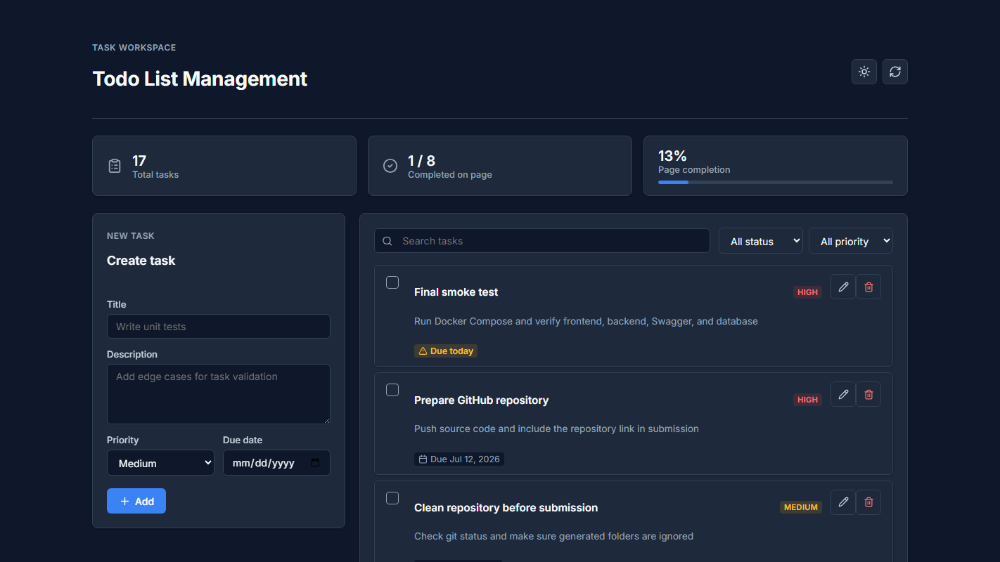
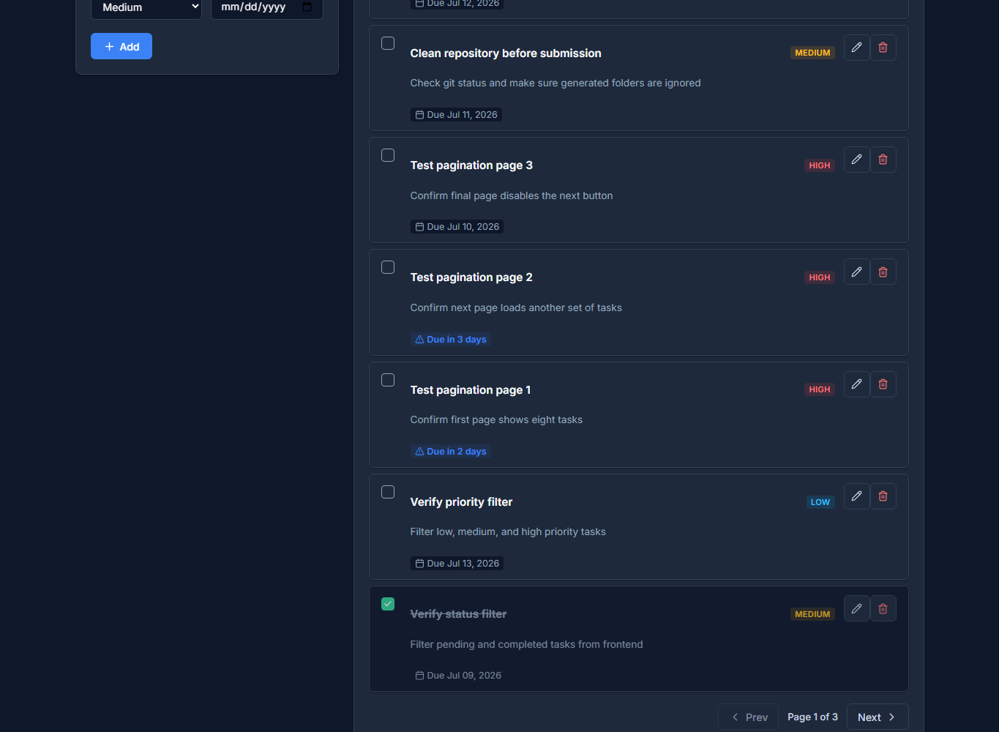
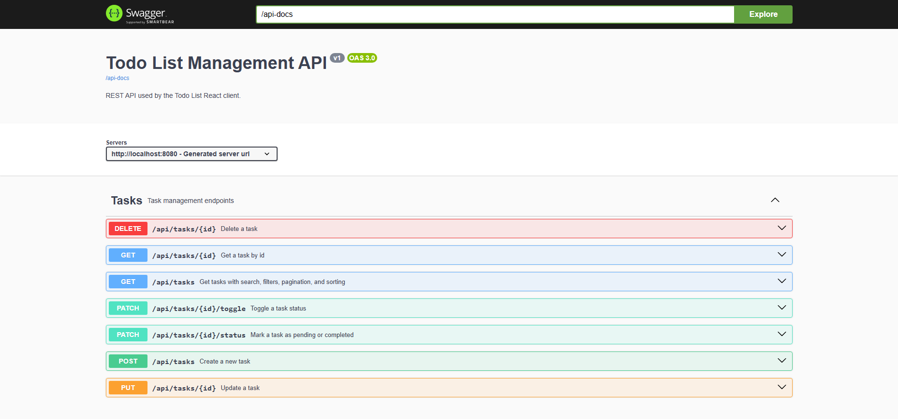

# Todo List Management

A small full-stack todo app for practicing a normal CRUD flow with React,
Spring Boot and MySQL. I kept the scope simple, but tried to make the parts
that reviewers usually check easy to run and easy to read.

## Stack

- Frontend: React, Vite, plain CSS
- Backend: Java 21, Spring Boot, Spring Web, Spring Data JPA
- Database: MySQL 8
- API docs: Swagger UI / OpenAPI
- Other: Docker Compose, Flyway, Postman collection, basic unit tests

## Features

- Create, update and delete tasks.
- Mark a task as pending or completed.
- Search by title or description.
- Filter by status and priority.
- Pagination from the backend API.
- Sort by newest task first.
- Highlight tasks that are due today, due soon or overdue.
- Validate invalid input on both frontend and backend.
- Show loading, empty, success and error states.
- Responsive layout for desktop and smaller screens.

## Screenshots

### Todo List App



### Task List And Pagination



### Swagger API



## Project Structure

```txt
todo-list-management/
  backend/                 Spring Boot REST API
  frontend/                React application
  database/                Manual SQL and demo seed data
  docs/                    Technical notes and screenshots
  postman/                 Postman collection
  docker-compose.yml       MySQL + backend + frontend
```

## Requirements

For the Docker setup:

- Docker Desktop
- Java 21
- Maven 3.9+

For local frontend development:

- Node.js 20+

The recommended way to review this project is Docker because it starts MySQL,
the Spring Boot API and the React app with the same configuration.

## Run With Docker

Start Docker Desktop first and wait until it shows that Docker is running.

From the project root:

```powershell
cd D:\todo-list-management
```

### 1. Build The Backend Jar

The backend Docker image copies the jar from `backend/target`, so build the jar
before running Docker Compose:

```powershell
cd backend
$env:MAVEN_OPTS="-Xmx256m -XX:MaxMetaspaceSize=160m"
mvn -DskipTests clean package
cd ..
```

This creates:

```txt
backend/target/todo-list-backend-0.0.1-SNAPSHOT.jar
```

### 2. Start MySQL, Backend And Frontend

```powershell
docker compose up --build -d
```

If PowerShell does not recognize `docker compose`, try:

```powershell
docker.exe compose up --build -d
```

Docker Compose starts these services:

| Service | Container | Port | Purpose |
| --- | --- | --- | --- |
| mysql | `todo-list-mysql` | `3307:3306` | MySQL database |
| backend | `todo-list-backend` | `8080:8080` | Spring Boot REST API |
| frontend | `todo-list-frontend` | `3000:80` | React app served by Nginx |

Check that all services are running:

```powershell
docker compose ps
```

Expected result:

```txt
todo-list-mysql      Up / healthy
todo-list-backend    Up
todo-list-frontend   Up
```

### 3. Load Demo Data

Flyway creates and migrates the `tasks` table automatically when the backend
starts. When using Docker, do not run `database/schema.sql` manually; keep it as
a reference script for local review.

To load demo tasks for checking search, deadline badges and pagination:

```powershell
Get-Content -Raw database\seed.sql | docker exec -i todo-list-mysql mysql -uroot -proot todo_list_db
```

The seed file inserts 17 tasks. The frontend requests 8 tasks per page, so
pagination shows `Page 1 of 3`.

### 4. Open The App

```txt
Frontend:   http://localhost:3000
Backend:    http://localhost:8080
Swagger UI: http://localhost:8080/swagger-ui.html
OpenAPI:    http://localhost:8080/api-docs
MySQL:      localhost:3307
```

### 5. Useful Docker Commands

```powershell
docker compose ps
docker compose logs -f backend
docker compose logs -f frontend
docker compose logs -f mysql
docker compose down
```

Reset all Docker containers and database volume:

```powershell
docker compose down -v
```

Then start again:

```powershell
docker compose up --build -d
```

Docker database connection:

```txt
Database: todo_list_db
Username: root
Password: root
Backend host: mysql:3306
Local host: localhost:3307
```

### Docker Troubleshooting

If the backend container fails because the jar does not exist, run:

```powershell
cd backend
$env:MAVEN_OPTS="-Xmx256m -XX:MaxMetaspaceSize=160m"
mvn -DskipTests clean package
cd ..
docker compose up --build -d
```

If ports are already used, stop the app using those ports or change the port
mapping in `docker-compose.yml`.

If the UI opens but the list is empty, import the seed data again:

```powershell
Get-Content -Raw database\seed.sql | docker exec -i todo-list-mysql mysql -uroot -proot todo_list_db
```

## Run Locally

Use this option if MySQL is already running on your machine. Docker is still the
recommended review path because it avoids local MySQL configuration differences.

Create the database:

```sql
CREATE DATABASE IF NOT EXISTS todo_list_db
    CHARACTER SET utf8mb4
    COLLATE utf8mb4_unicode_ci;
```

Run backend:

```powershell
cd backend
mvn spring-boot:run
```

Default local database config:

```txt
URL: jdbc:mysql://localhost:3306/todo_list_db
Username: root
Password: empty
```

If your MySQL password is not empty:

```powershell
$env:DB_PASSWORD="root"
mvn spring-boot:run
```

If you want to run the backend locally but use the Docker MySQL service:

```powershell
$env:DB_URL="jdbc:mysql://localhost:3307/todo_list_db?useSSL=false&allowPublicKeyRetrieval=true&serverTimezone=Asia/Ho_Chi_Minh"
$env:DB_USERNAME="root"
$env:DB_PASSWORD="root"
mvn spring-boot:run
```

Run frontend:

```powershell
cd frontend
npm install
npm run dev
```

Frontend dev server:

```txt
http://localhost:5173
```

## API

Base URL:

```txt
http://localhost:8080/api
```

| Method | Endpoint | Purpose |
| --- | --- | --- |
| GET | `/tasks` | List tasks with search, filter, pagination and sorting |
| GET | `/tasks/{id}` | Get one task |
| POST | `/tasks` | Create a task |
| PUT | `/tasks/{id}` | Update a task |
| PATCH | `/tasks/{id}/status` | Set task status |
| PATCH | `/tasks/{id}/toggle` | Toggle task status |
| DELETE | `/tasks/{id}` | Delete a task |

List query example:

```txt
GET /api/tasks?keyword=readme&status=PENDING&page=0&size=8&sort=createdAt,desc
```

Create request example:

```json
{
  "title": "Write README",
  "description": "Add setup steps and API notes",
  "priority": "HIGH",
  "dueDate": null
}
```

Use today or a future date for `dueDate` when you want to test deadline badges.

## Postman

Import this file into Postman:

```txt
postman/Todo_List_Management_API.postman_collection.json
```

Collection variables:

```txt
baseUrl = http://localhost:8080
taskId = 1
```

## Tests

Backend unit tests:

```powershell
cd backend
mvn test
```

Frontend build check:

```powershell
cd frontend
npm run build
```

## Notes

- The app uses DTOs instead of exposing JPA entities directly through the API.
- Validation errors are returned in a consistent JSON format.
- `database/schema.sql` is kept for manual review; the running app uses Flyway
  migrations from `backend/src/main/resources/db/migration`.
- More design details are in `docs/SYSTEM_DESIGN.md`.
